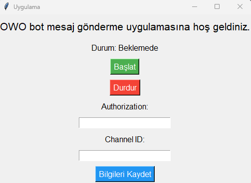
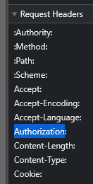

# Discord OWO BOT
 
Owo Bot Otomatik Oynatıcı
Bu proje, Discord'da popüler olan "Owo Bot" oyununu otomatik olarak oynamanızı sağlayan bir uygulamadır. Owo Bot, kullanıcıların farklı komutları kullanarak puan kazandığı ve diğer kullanıcılarla yarıştığı eğlenceli bir oyundur. Bu uygulama, sizin yerinize komutları otomatik olarak kullanarak puan kazanmanızı sağlar.

Özellikler
Bot WH, WB, Wpray, ve WCF oyun modlarını otomatik olarak oynayabilir.
Botun kullanılması durumunda, owonun bot sistemine yakalanma riski yoktur.
Tamamen güvenli bir şekilde çalışır ve Discord kurallarına uygundur.

Kurulum:

1) Öncelikle internet tarayıcınızdan discord hesabınıza giriş yapınız.
2) Daha sonra uygulamayı bir klasörün içine atınız ve orada çalıştırınız.
3) 
4) bu şekilde bir ekran sizleri karşılayacaktır.
5) Öncelikle "Channel ID: " kısmı için botun çalışmasını istediğiniz sunucuya gelin ardından oynayacağınız odaya sağ tıklayın.
6) 
7) bu durumda benim kullanacağım oda owo yazan oda ona sağ tıklıyorum ve en altta çıkan Channel ID kopyala seçeneğine basıyorum ve uygulamanın Channel ID kısmına yapıştırıyorum.
8) Daha f12 tuşuna basarak sitenin arayüzüne giriyoruz.
9) Daha sonrasında açılan o ekranda
10) 
11) buradan "network" ekranına geliyoruz.
12) Daha sonrasında mesaj kanalına herhangi bir mesaj atıyoruz, ne yazdığımız önemli değil ben "s" harfi yollicam siz isterseniz cümle dahi yazabilirsiniz.
13) 
14) Daha sonrasında
15)  network'ün altında bu şekilde messages kısmı açılacak ona tıklıyoruz.
16) Açılan ekranda "Request Headers" sekmesinin altında "Authorization" bulunmakta
17) 
18) Authorization'ın sağında bulunan kodu kopyalıyoruz, bu kod herkeste farklıdır ve lütfen başkası ile paylaşmayınız.
19) Aldığımız bu kodu uygulamamızda bulunan Authorization kısmına yapıştırıyoruz ardından bilgileri kaydet butonuna basıyoruz. 
20) Daha sonrasında uygulamamızı güvenle kullanabilirsiniz.
